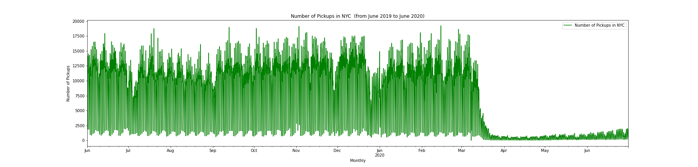
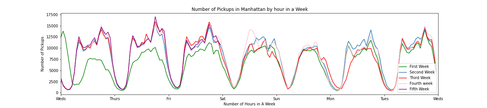

# Forecasting Taxi Demand in New York City

## File Structure:
- 01.Data_Preprocessing.ipynb - Preprocess the dataset and cleaned the data
- 02.Exploratory_Data_Analysis.ipynb - Visualizations for all of NYC and different boroughs distributions
- 03.Baseline_Models_precovid.ipynb  - Baseline Models for NYC Boroughs ( 06/01/2019 to 03/21/2020)
- 03.Baseline_Models_postcovid.ipynb - Baseline Models for NYC Boroughs (03/22/2020 to 06/30/2020)
- 04-1.Manhattan_Models_postcovid.ipynb - Modeling for Manhattan after Lockdown initiated
- 04-2.Manhattan_Models_precovid.iypnb - Modeling for Manhattan before Lockdown ( WORK IN PROGRESS )
- 05.Queens_Models.ipynb - Modeling for Queens (WORK IN PROGRESS)

## Background:
Uber arrived in New York City in 2012 and since then, there has been massive decrease in riderships. The problem has persisted and has grown worse exponentially. In 2012, the daily riderships were roughly 500,000 trips per day. By 2019, on average there are about 230,000 rides a day. That is more than half in seven years! [Taxi News](https://www.nydailynews.com/new-york/ny-medallion-foreclosures-taxi-bailout-plan-uber-lyft-20200130-s2mjkhjubzgptdxasoxddwdote-story.html "news source"). Unlike its competitors (uber/lyft), taxi drivers do not have access to "hot zone" locations via their phones as they do not have a "yellow cab app" separately for such luxury. What this project will be forecasting is the number of riderships in the future by different boroughs to determine where and when the pickups will be most needed. Another thing to note is that the lockdown in NYC started in March 22, 2020. As this was an unexpected event, we will see how the lockdown has impacted the number of riderships in 2020. 

As you can see on the graph, there was a huge drop in March and that happened due to the lockdown in New York City.

## Dataset:
Dataset comes from [taxi data](https://www1.nyc.gov/site/tlc/about/tlc-trip-record-data.page "Taxi Dataset in NYC [nyc.gov]").
It consists of...
- Comes from NYC Open Data
- ~70M observations
- Ranges from June 2019 to June 2020

## Data Cleaning:
- Separated the data by boroughs
- Cleaned the wrong data such as mislabeled observations (wrong year and month)
- Converted to datetime object and set as index
- Resample the data so that it is in hourly interval
- Increment count for each interval

- Due to different boroughs, pre-lockdown and post-lockdown, for this project, I will forecast Manhattan for now as most of the riderships come from Manhattan. 

## Exploratory Data Analysis:

#### Weekly Distribution (January):

